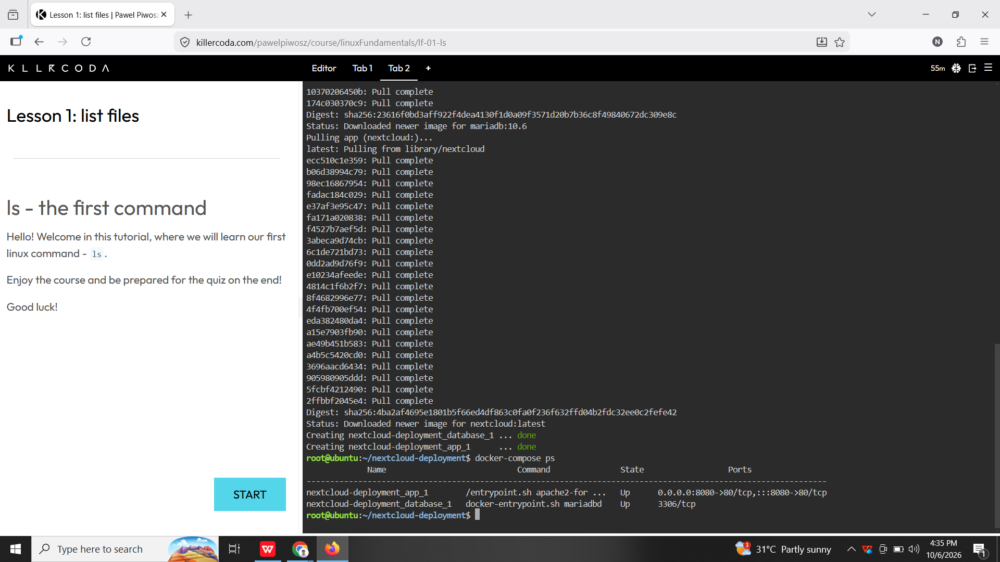
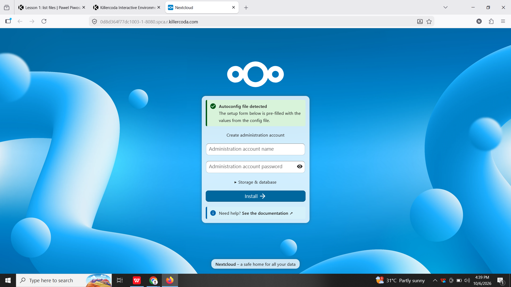
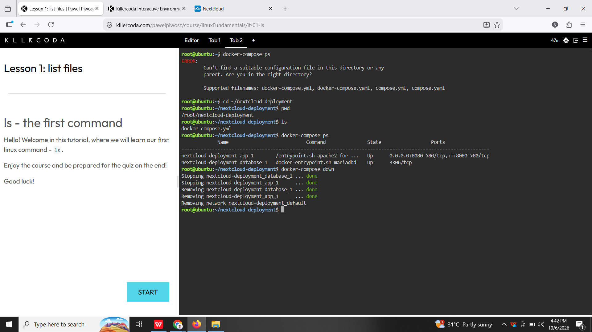

# Laboratory 06 - Cloud Deployment Engineer

## Mission Overview

In this laboratory, I deployed a two-tier private cloud storage environment using Docker Compose. The environment uses Nextcloud as the web/application tier and MariaDB as the database tier. The two containers communicate with each other through Docker Compose.

## Objectives

* Understand two-tier architecture
* Deploy a MariaDB database container
* Deploy a Nextcloud application container
* Create a Docker Compose configuration
* Deploy multiple containers using Docker Compose
* Access Nextcloud through a browser
* Properly shut down and remove the containers
* Document Infrastructure as Code practices

## Commands Executed

```bash
mkdir nextcloud-deployment
cd nextcloud-deployment
nano docker-compose.yml
docker-compose up -d
docker-compose ps
docker-compose down
```

## Skills Learned

* Two-tier cloud architecture
* Docker Compose
* YAML configuration
* Multi-container deployment
* Environment variables
* Container networking
* Nextcloud deployment
* MariaDB database deployment
* Infrastructure as Code
* Docker container management

## Screenshots

### Docker Compose Deployment



### Nextcloud Web Interface



### Docker Compose Teardown


